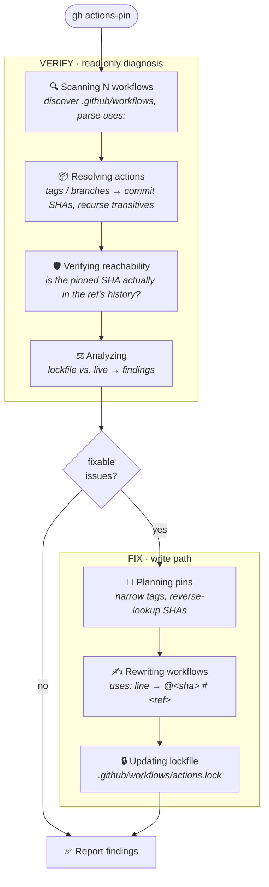

# gh-actions-pin

Manage your workflow dependencies.

## Install

```bash
gh extension install github/gh-actions-pin
```

## Usage

Scan every workflow under `.github/workflows/` and pin what it can -- pinning
each resolvable action to an immutable SHA and updating the lockfile:

```bash
gh actions-pin
```

Scope the scan to a single workflow (same default behavior, one file):

```bash
gh actions-pin .github/workflows/ci.yml
```

By default, already-pinned workflows are trusted from the lockfile -- their
reachability isn't re-checked against upstream. To force a full re-verification
of every recorded pin (bypassing that fast path):

```bash
gh actions-pin --rescan
```

Read-only check for CI (reports findings, writes nothing):

```bash
gh actions-pin --no-fix --json=valid,findings
```

`--no-fix` controls whether fixes are applied; `--json` only selects the output
format. Structured results go to stdout, progress to stderr.

## How it works

GitHub Actions is a package manager that forgot to ship a lockfile. Your
workflows are the manifest -- every `uses:` line is a dependency, resolved by
mutable tag or branch *at runtime*, on GitHub's servers, with no record of what
actually ran. `gh-actions-pin` supplies the missing half: `.github/workflows/actions.lock`,
the Actions analogue of `go.sum` or `package-lock.json`. Each run resolves every
direct and transitive dependency to an immutable commit SHA, locks it, and
verifies the lock hasn't been tampered with before any of it runs.

A single `gh actions-pin` invocation walks two paths. The **verify** path is
read-only and always runs: it scans every workflow, resolves each dependency to
a commit SHA, and checks the result against the lockfile. The **fix** path
applies pins — rewriting `uses:` lines and updating the lockfile — for the
issues it can safely repair. The phase labels below are exactly what scrolls
past in the spinner.



The security guarantee lives in **Verifying reachability**: a SHA pin is only
trustworthy if that commit is reachable from the tag/branch it claims to come
from. A SHA that resolves but isn't in the ref's history is an *impostor commit*
-- the fork-network attack `gh-actions-pin` exists to catch -- and it's flagged
rather than silently trusted.

## Development

```bash
make build              # build
make test               # Go unit tests
make test-integration   # all integration scenarios (stub + live)
make test-stub          # stub scenarios only (no network, fast)
make test-live          # live repo scenarios only (clones real repos)
make test-shell         # interactive REPL (type help inside for commands)
```

### Scenario catalog

All scenarios are defined in `test/scenarios/catalog.yml` and consumed by both
the Go test suite (`test/scenarios/catalog_test.go`) and the Ruby integration
harness (`test/integration/run.rb`). Add new scenarios to the YAML -- both
sides pick them up.

### Environment variables

| Variable | Purpose |
|---|---|
| `GH_TOKEN` / `GITHUB_TOKEN` | Auth token for live tests (falls back to `gh auth token`) |
| `GH_ACTIONS_PIN_WORKFLOWS_DIR` | Override the workflows directory to scan (lab/testing use) |
| `KEEP_FIXTURES` | Keep temp dirs after test runs for debugging |

