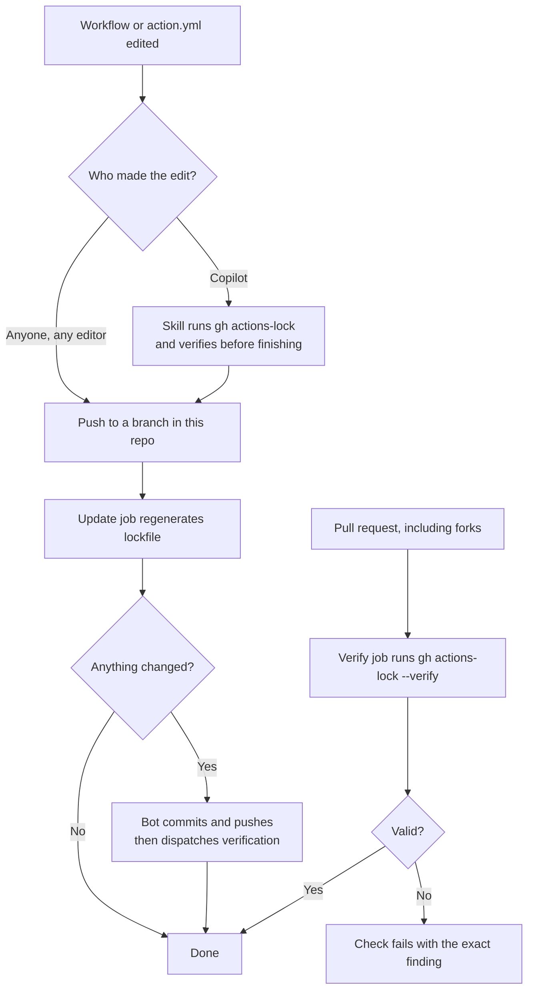

# Keeping a repository's Actions lockfile current

Use a Copilot skill and an Actions workflow to run `gh actions-lock` when
workflow dependencies change. This guide includes examples you can copy into
your repository.

> [!NOTE]
> gh-actions-lock is in public preview. Flags and lockfile format may change
> between releases. Because the update job rewrites source files, consider
> pinning the extension to a release you have tested:
> `gh extension install github/gh-actions-lock --pin v0.1.6`.

## Setup

The skill runs the CLI during Copilot-assisted edits. The Actions workflow
updates the lockfile on push and verifies it on pull requests.

| Piece | Location | Role |
| --- | --- | --- |
| Lockfile | `.github/workflows/actions.lock` | Records the resolved ref, commit, owner ID, and repo ID for every action dependency. Machine-generated. |
| Copilot skill | `.github/skills/actions-lock/SKILL.md` | Teaches Copilot to run and verify the lock command as part of any workflow change. |
| Automation workflow | `.github/workflows/actions-lock.yml` | Regenerates and commits the lockfile on push; verifies it on pull requests. |

Copy the skill and automation workflow into your repository. Generate the
lockfile with the CLI; do not create or edit it manually.

Ready-to-copy versions of the two you add live in [`examples/`](./examples):

- [`examples/actions-lock-workflow.yml`](./examples/actions-lock-workflow.yml)
- [`examples/actions-lock-SKILL.md`](./examples/actions-lock-SKILL.md)

## Workflow changes



### 1. Editing with Copilot

When you ask Copilot to add, upgrade, or remove an action, it discovers the
`actions-lock` skill and handles the lockfile itself: it runs `gh actions-lock`,
includes the generated changes in the same change set, and does not call the
task done until `gh actions-lock --verify` passes.

### 2. Editing workflows yourself

Edit the workflow however you like and push to a branch. The `update` job runs
the lock command for you and, if anything changed, commits the result back to
your branch as `github-actions[bot]`. Pull afterwards:

```bash
git pull
```

> [!NOTE]
> Commits pushed with `GITHUB_TOKEN` do not trigger new `push` or
> `pull_request` runs. The update job therefore dispatches the workflow
> explicitly after committing, so the bot's own commit still gets verified.

### 3. Pull requests and forks

Every pull request touching workflows or local actions runs the read-only
`verify` job. Fork pull requests are verified but never written to, because the
pull request token cannot safely push to a fork. A contributor from a fork fixes
a stale lockfile by running `gh actions-lock` locally and pushing the result.

## Generated changes

`gh actions-lock` does not only write the lockfile. On a fix run it also edits
your source files, so review the diff accordingly:

- **Workflow `uses:` refs are rewritten** to the narrowed ref it resolved. A
  freshly pinned `actions/checkout@v6` becomes `actions/checkout@v6.1.0`,
  preserving the resolved commit while recording a specific version. Pass
  `--no-narrow` to keep the original ref.
- **Same-repo `./…` action references are migrated to `$/…`**, in both
  workflows and in your in-repo composite `action.yml` files. `$/…` always
  resolves to the running commit of the repository, so it is inherently pinned
  and needs no lockfile entry. Pass `--no-migrate-local-actions` to opt out.

### Local actions

A `./…` reference is resolved **relative to the repository root**, not to the
directory of the file containing it. This matches how the Actions runner
resolves it:

```yaml
# my-action/action.yml
runs:
  using: composite
  steps:
    - uses: ./helper        # resolves to <repo-root>/helper, NOT my-action/helper
```

If the path resolves to a real in-repo `action.yml` or `action.yaml`, it is
migrated to `$/helper` and any third-party actions it reaches are pinned
transitively. If it does not resolve, the workflow is reported as skipped —
`local path actions are not yet supported` — and gets no lockfile entry. For a
workflow already in the lockfile, the same situation is a hard error instead of
a skip, so it fails the `verify` job rather than silently dropping coverage.

Fix an incorrect path and re-run the CLI. If the action is generated or checked
out from another repository and cannot be inspected, defer onboarding the
affected workflow, not the entire repository. Do not include it in a **Require
lockfile** policy until it can be locked and verified. For an already-onboarded
workflow, investigate the failure without manually removing its lockfile entry.

## Reusable workflows

### Dependency ownership

A lockfile pins the actions used by the workflows in its own repository,
including transitive dependencies. It does not reach across a reusable workflow
call. When you call `octo/shared/.github/workflows/deploy.yml`, the actions that
workflow runs are resolved in `octo/shared` against *its* lockfile, at the commit
you called.

So calling a reusable workflow means trusting that the repository you called has
locked its own dependencies. Your lockfile cannot do it for them.

Pinning the reusable workflow reference selects the called repository's commit,
including the workflow and its lockfile. The called repository is responsible
for keeping its own dependencies locked.

For reusable workflows:

- Pin the reusable workflow reference to a commit SHA.
- Confirm the repositories you call are onboarded themselves. For internal
  shared workflows, that is a rollout question. See
  [Organization and enterprise rollout](organization-and-enterprise-rollout.md).

### CLI handling of job-level `uses:`

> [!NOTE]
> Guidance for job-level reusable workflow calls
> (`jobs.<id>.uses: owner/repo/.github/workflows/x.yml@ref`) is still under
> review and is intentionally omitted here. Until it is settled, run the
> verify-only automation in repositories that call remote reusable workflows,
> and review lockfile changes before committing them.

Self-repository calls written as `$/.github/workflows/x.yml` are unaffected:
they resolve to the running commit and need no entry.

## Running it yourself

This is the same command the automation runs:

```bash
gh extension install github/gh-actions-lock
gh actions-lock
```

Installing when the extension is already present prints a warning and exits
zero, so the step is safe to repeat.

Read-only check. Writes nothing, exits non-zero when the lockfile is stale:

```bash
gh actions-lock --verify
```

Offline coverage check. No network and no token required, so it suits a
pre-commit hook. It confirms every ref has a lockfile entry, but does not
re-verify the pins themselves:

```bash
gh actions-lock --verify-local
```

Machine-readable output for scripting:

```bash
gh actions-lock --no-fix --json=valid,findings
```

## Upgrading an action

Change the `uses:` ref in the workflow, then let the automation or the skill
re-resolve it. Refs that legitimately move — branches like `main`, or partial
versions like `v4` — are trusted from the lockfile on a normal run rather than
re-resolved. Bump them deliberately:

```bash
gh actions-lock --relock
```

If a recorded commit is no longer reachable upstream, that is treated as
suspicious and left as an error. Re-resolve those with `--accept-moved`.

Dependencies bumped by Dependabot are handled separately: it updates the
workflow YAML and regenerates the matching lockfile entry in the same pull
request. See [Dependabot and the Actions lockfile](./dependabot.md).

## Troubleshooting

Do not create or repair a lockfile by hand. Manual edits bypass dependency
resolution and can make its refs, commits, or repository IDs inconsistent.
Verification or workflow startup can fail, and regeneration may overwrite the
edits. Change workflow inputs where needed, then regenerate with the CLI.

The CLI reports findings with details and, where available, remediation.
These are common cases, not an exhaustive catalog of every message:

| Finding or failure | Next step |
| --- | --- |
| `not-pinned`, `ref-changed`, or `stale` | Review the workflow changes, run `gh actions-lock --no-interactive`, then `gh actions-lock --verify`. |
| `onboarding-required` | A run with `--no-onboard` cannot add coverage. Run the CLI without that flag to onboard the workflow deliberately. |
| `local-action` / local path actions not supported | Check the repository-root-relative path and action definition. If it cannot be inspected, defer onboarding that workflow. See [Local actions](#local-actions). |
| `invalid-self-repository-ref` | Fix the `$/…` path or remove a forbidden `@ref` suffix, then re-run the CLI. |
| `ref-moved` | Review the upstream change. To update a legitimately moved ref, run `gh actions-lock --relock`. |
| `unreachable-pin` or `misleading-sha` | Investigate the upstream ref and history before accepting a change. Use `--relock --accept-moved` only after confirming an unreachable pin resulted from a legitimate move. |
| `ancestry-unknown`, `reachability-unknown`, or API/authentication errors | Check token access, network connectivity, and API rate limits, then retry verification. An inconclusive check is not proof of a valid pin. |
| Unreadable workflow or lockfile | Read the reported parse or file error. Correct workflow YAML; for a damaged lockfile, restore a known-good generated version from version control and re-run the CLI. |

The CLI's diagnostic links currently point to general
[security-hardening guidance](https://docs.github.com/en/actions/security-for-github-actions/security-guides/security-hardening-for-github-actions#using-third-party-actions);
there is not yet a dedicated explanation for every finding.

## Reviewing changes

- Never hand-edit `.github/workflows/actions.lock`. Regenerate it instead.
- Review lockfile diffs like any other dependency change. A changed commit SHA
  is what to look at.
- If verification fails, read the reported finding rather than deleting entries
  to make it pass.

## Requirements and caveats

- The [`gh` CLI](https://cli.github.com/) on any machine that runs the command
  directly. GitHub-hosted runners already have it.
- Branch protection must allow GitHub Actions to push to branches, otherwise the
  update job cannot commit the regenerated lockfile.
- The automation grants `contents: write` only to the push-triggered update job.
  The pull request job stays read-only.
- Pushing to a branch that already has an open pull request fires two runs: a
  `push` run for `update` and a `pull_request` synchronize run for `verify`.
  They use different concurrency groups, so `verify` can briefly fail against
  the pre-update commit. The dispatched run after the bot commit is the
  authoritative one. A push to a branch with no open pull request only runs
  `update`.
- The update job pushes a commit onto the branch you just pushed. Your next
  push from that branch is rejected as non-fast-forward until you `git pull`.
- Repositories that do not want a bot commit on every workflow edit should drop
  the `update` job and keep only `verify`, making a stale lockfile a failed
  check that the author fixes locally.

## Related

- [Rolling out lockfiles across an organization or enterprise](./organization-and-enterprise-rollout.md)
- [Dependabot and the Actions lockfile](./dependabot.md)
